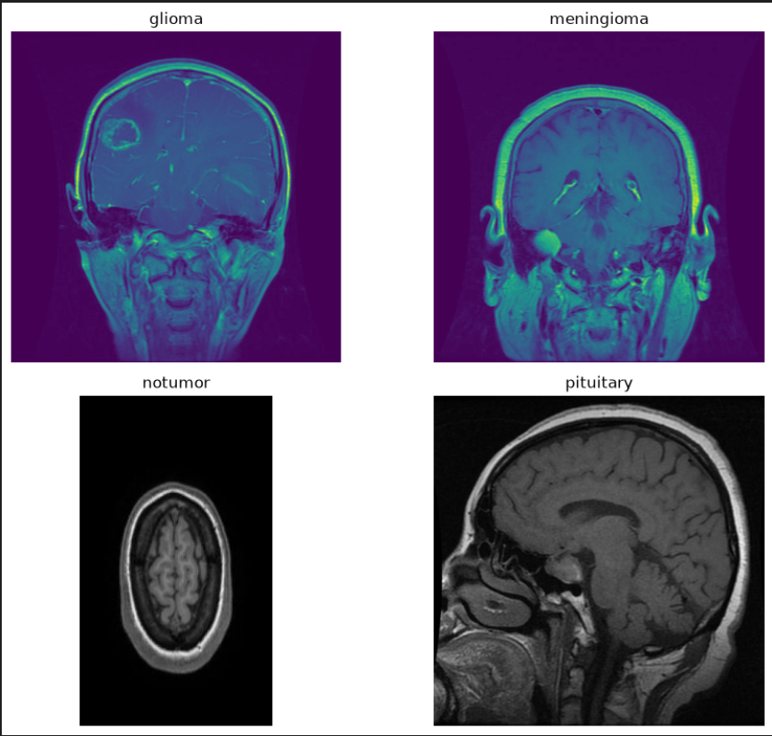

# 🧠 Brain Tumour Classification using CNN

> A CNN-based image classification project for classifying brain MRI images into four categories.

---

## 📸 Screenshot

---

## 🎯 Overview

This project uses a **Convolutional Neural Network (CNN)** to classify brain MRI images into four different classes.

## 🏷️ Classes

- 🧠 Glioma
- 🧠 Meningioma
- ✅ No Tumor
- 🧠 Pituitary

## 📂 Dataset

- Total Images: **6,892**
- Image Size: **128 × 128**
- Training: **5,513**
- Validation: **689**
- Testing: **690**

## 🛠️ Technologies Used

- 🐍 Python
- 🤖 TensorFlow / Keras
- 🔢 NumPy
- 📊 Pandas
- 📈 Matplotlib
- 📋 Scikit-learn

## 🧩 Model Architecture

- 🔄 Data Augmentation
- 🔲 Convolutional Layers
- ⬇️ Max Pooling Layers
- 🔗 Dense Layers
- 🎯 Softmax Output Layer

## ⚙️ Training

- Optimizer: **Adam**
- Loss Function: **Sparse Categorical Crossentropy**
- Epochs: **20**
- Early Stopping: **Used**

## 📊 Results

| Metric | Score |
|---|---:|
| 🏋️ Training Accuracy | **95.79%** |
| 🔍 Validation Accuracy | **94.05%** |
| 🧪 Test Accuracy | **93.77%** |

## 🔎 Evaluation

The model was evaluated using:

- ✅ Accuracy
- 📉 Loss
- 📋 Classification Report
- 🔲 Confusion Matrix
- 🖼️ Image Predictions

## 💾 Model

The trained model is saved in **`.keras`** format for future use.